<picture>
  <source media="(prefers-color-scheme: dark)" srcset="assets/name-dark.svg">
  <source media="(prefers-color-scheme: light)" srcset="assets/name-light.svg">
  
</picture>

Machine-learning researcher and engineer in Zürich. I published first-author work on explaining spiking neural networks at Intel Labs, deployed computer vision in customer plants at Siemens, and now build the multi-agent system that scientists at the [Botnar Institute of Immune Engineering](https://immune.engineering/) use to review manuscripts.

### Three threads of work

**Agents and knowledge graphs for science** 
BIIE, 2025 to now. In production use, validated blind against expert reviews on 30 preprints. 
[Case study: how the knowledge graph is built and used](https://ammar-bitar.github.io/work/knowledge-graph.html)

**Spiking networks and event-based vision** 
Intel Labs, 2020 to 2022. First-author paper in *Frontiers in Neuroscience*; event cameras on the Autobahn. 
[Case study: which spikes a spiking network actually uses](https://ammar-bitar.github.io/work/snn-explainability.html) · [Case study: the Autobahn through an event camera](https://ammar-bitar.github.io/work/providentia.html)

**Vision on the edge and at scale** 
Siemens, 2023 to 2025. Shipped to customers on Jetson; SAM fine-tuned across 16 H100s. 
[Case study: catching defects at line speed](https://ammar-bitar.github.io/work/edge-vision.html)

### Publication

Bitar, A., Rosales, R., Paulitsch, M. *Gradient-based feature-attribution explainability methods for spiking neural networks.* Frontiers in Neuroscience 17, 2023. [doi:10.3389/fnins.2023.1153999](https://doi.org/10.3389/fnins.2023.1153999)

---

[Website](https://ammar-bitar.github.io) · [LinkedIn](https://www.linkedin.com/in/ammar-bitar) · [ammar.bitar@outlook.com](mailto:ammar.bitar@outlook.com) · [CV (PDF)](https://ammar-bitar.github.io/assets/Ammar_Bitar_CV.pdf)
